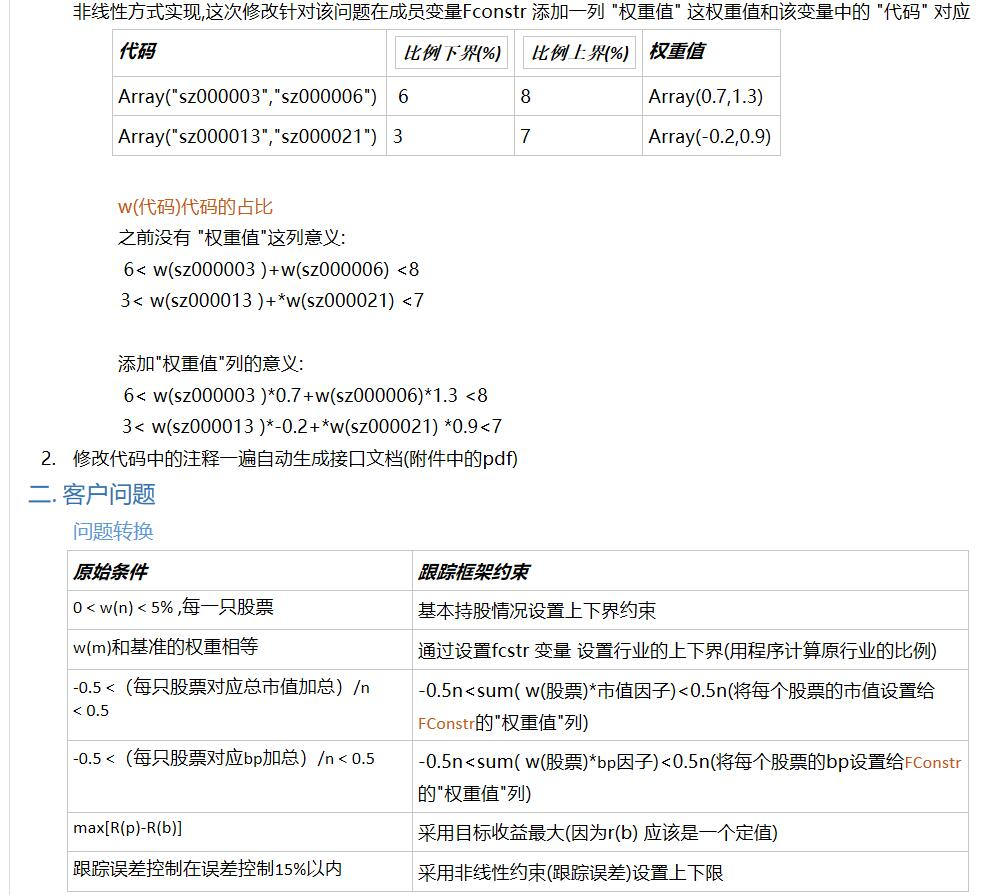

# selfportfliooptimizer
*类型:* type

**说明**

>  组合优化类扩展 ,修改init函数可以扩展约束;
   该类的默认条件1\. 给定的基准为指数代码(可以不用重载getydata函数) 2\. 基准指数成分在给定的数据\_infodata中可以找到
   3\.给定的\_infdata保护说明中的字段


***
*父类:* tsportfoliooptimizer;
## 成员变量
|名称|作用域|类型|说明|是否静态变量
|--|--|--|--|--
|_infdata|public|array| 信息, 约束条件等都从其中获得数据<br>                           二维数组包括字段<br>                           "代码" : 证券代码<br>                           "名称" : 证券名称<br>                           "比例(%)" : 实际比例<br>                           "比例下界(%)" : 限制比例下界<br>                           "比例上界(%)" : 限制比例上界<br>                           "行业名称",  :行业名称<br>                           下面字段是约束时使用<br>                           "流通市值"<br>                           "总市值"	,<br>                           "总资产",<br>                           "总股本",<br>                           "EP",<br>                           "BP",<br>                           "综合因子"|


## 函数声明
|函数名|参数个数|作用域|是否静态函数|virtual
|--|--|--|--|--
|getinfodata|0|public|0|
|init|0|public|0|

**代码**<br>
[selfportfliooptimizer代码](../code/example_portfolio1.tsf)<br>
**需求分析** <br>


组合跟踪范例\-
```
obj := new   selfportfliooptimizer();
obj.FIndexID := "SH000300" ;//设置基准指数
Obj.FBegT:=20160107T; //跟踪开始时间  
Obj.FEndT:=20170107T; //跟踪截止时间
Obj.FObjType:=1;   //设置收益最大
Obj.FConType:=0;  // 设置非线性约束 跟踪误差
obj.FThresholdUpper:=15;  //设置非线性约束上界
obj.init(); //构造约束
Ret:=obj.PortfolioOptimize();
return  array(
              "优化信息":Ret,
              "优化后比例":obj.GetPortfolioData(),
              "优化评价":obj.GetReturnandRisk()
              );
```
## getinfodata
*类型:* function
*作用域:* public


**说明**

>  修改此函数对 \_infdata 赋值;


**定义:getinfodata();**

## init
*类型:* function
*作用域:* public


**说明**

>  此函数处理线性约束
	  1\. 个股上下界
	  2\. 基准行业占比
	  3\. 市值基准占比
	  4\. bp基准占比


**定义:init();**


***
